<div align="center">


# Leo Billing.

### Home Business Invoicing — Simple, Fast, Unlimited

[](https://leo-billing.vercel.app/)
[](https://github.com/sachinle/leo-billing/releases/latest)
[](https://react.dev)
[](https://supabase.com)
[](https://capacitorjs.com)

</div>

---

## 🎯 Why I Built This

My family runs a small home-based cake shop. We were using a popular billing app's free tier — but it came with painful limits:

| Problem | Impact |
|---|---|
| ❌ Only 7 invoices per week | Couldn't bill all customers |
| ❌ No cloud backup | Lost data when phone changed |
| ❌ Single user only | My mom and I couldn't share access |
| ❌ Web access required paid plan | Stuck on mobile only |

So I built **Leo Billing** — a modern, full-stack invoicing system built specifically for home businesses like ours. Unlimited invoices, cloud sync, works on both mobile and desktop, completely free to self-host.

---

## 📸 Screenshots (Web)

<!-- SCREENSHOTS START — replace the placeholder rows below with your actual images -->
| Login | Customers Details |
|:--------------:|:------------:|
| 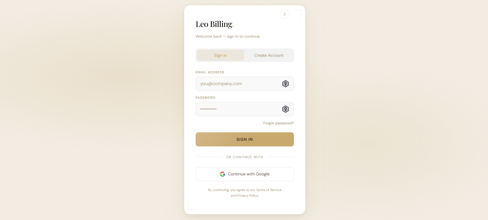 | 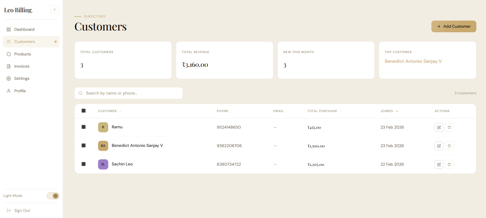 |

| Dashboard | Invoices |
|:---------:|:--------:|
| 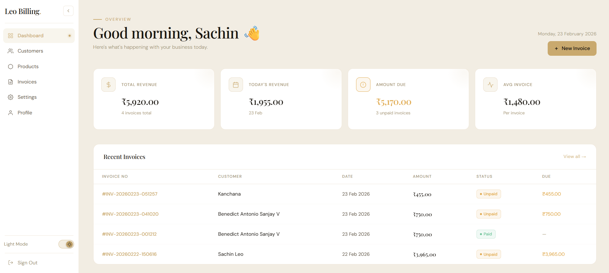 | 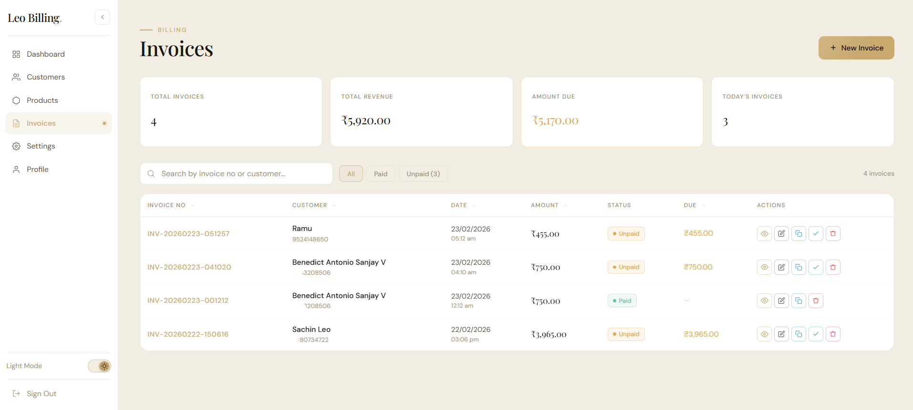 |

| Create Invoice | View Invoice |
|:--------------:|:------------:|
| 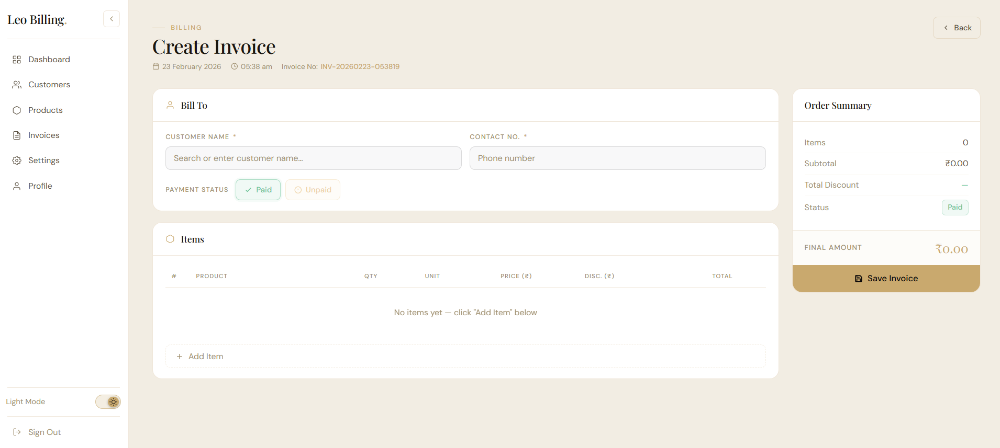 | 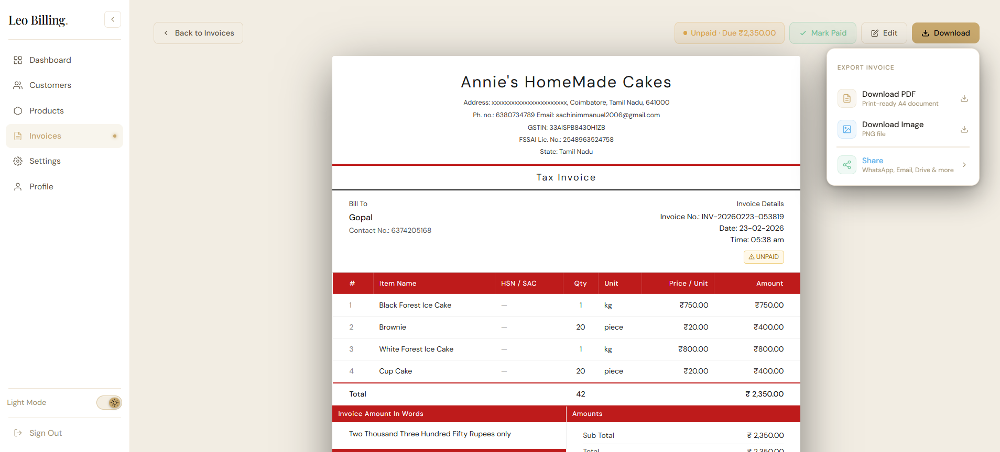 |


| Dark Mode | Share / Export |
|:---------:|:--------------:|
| 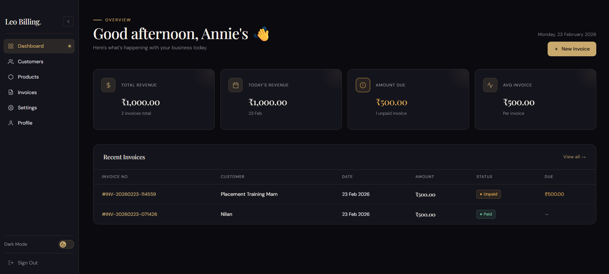 |  |

| Settings | Profile |
|:---------:|:--------------:|
| 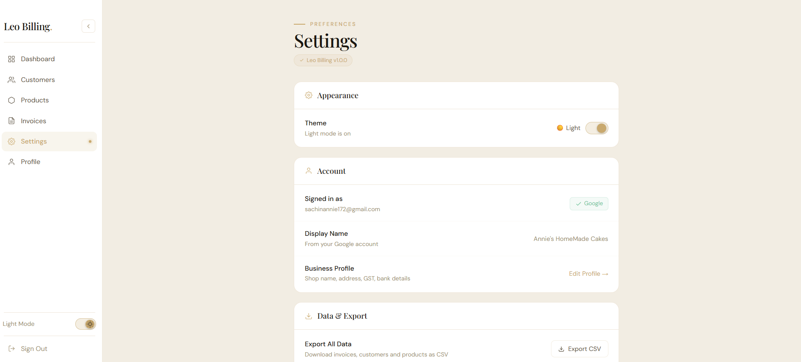 |  |

<!-- SCREENSHOTS END -->

## 📸 Screenshots (Mobile)

<!-- SCREENSHOTS START — replace the placeholder rows below with your actual images -->
| Mobile App | Google Account Signin |
|:--------------:|:------------:|
| 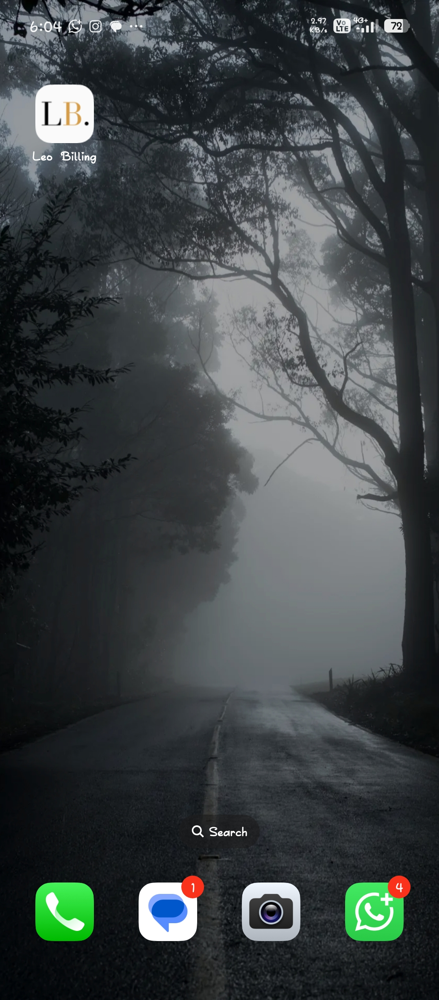 | 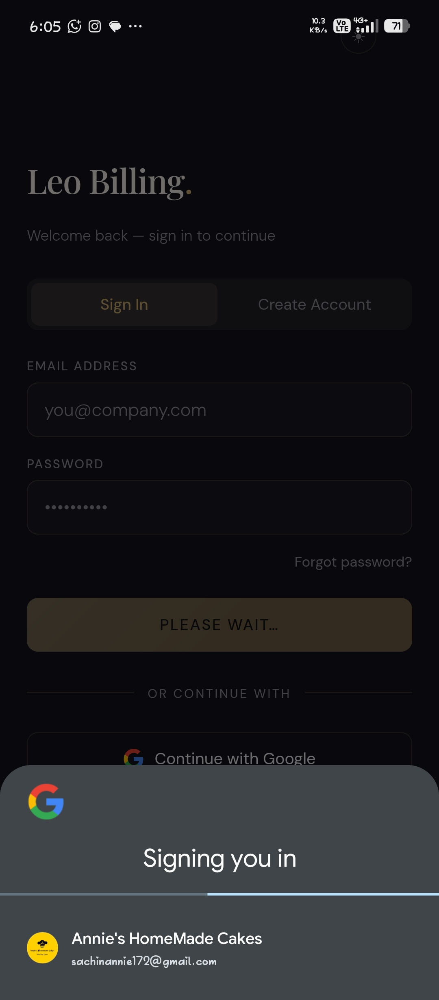 |

| Login | Customers Details |
|:--------------:|:------------:|
| 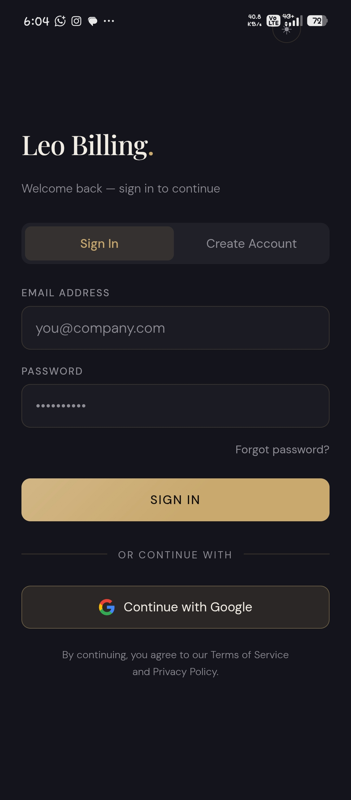 | 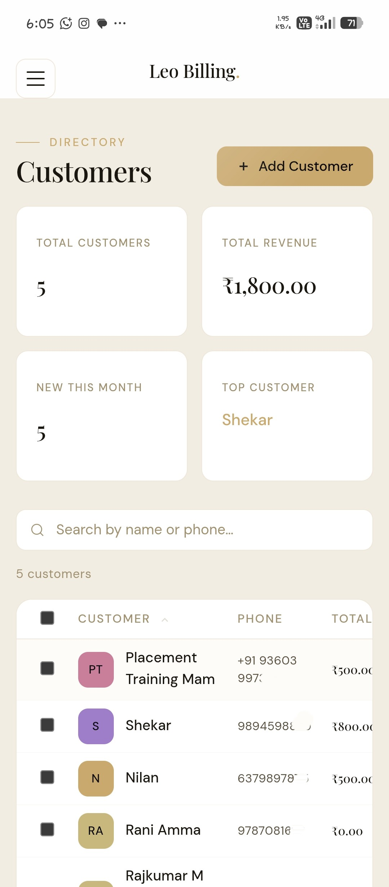 |

| Dashboard | Invoices |
|:---------:|:--------:|
| 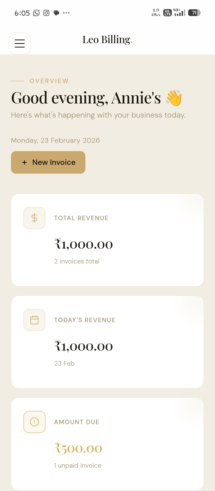 | 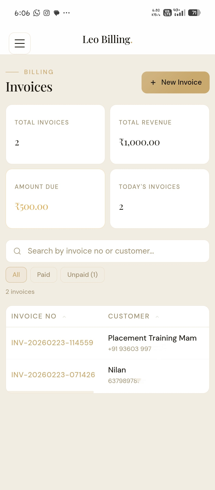 |

| Create Invoice | View Invoice |
|:--------------:|:------------:|
| 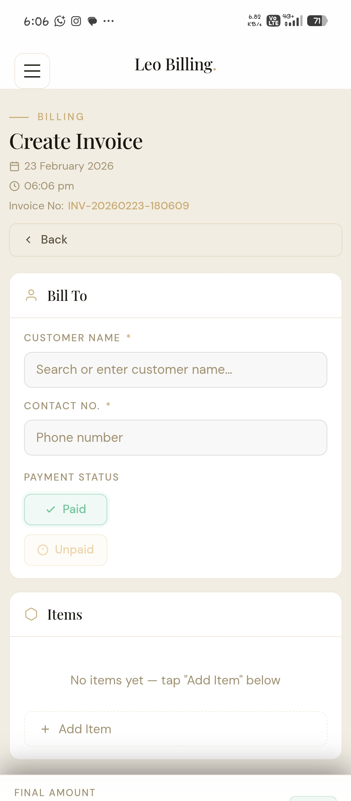 | 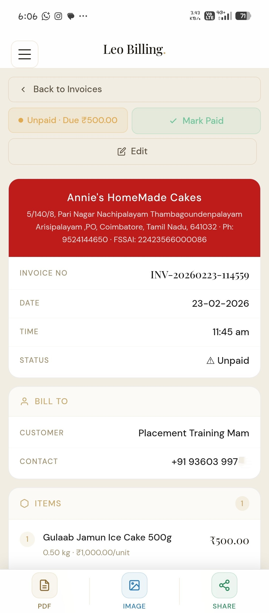 |

| Product | Invoice Download |
|:--------------:|:------------:|
| 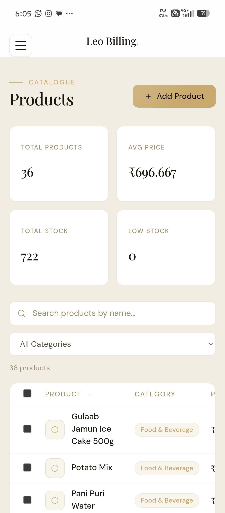 | 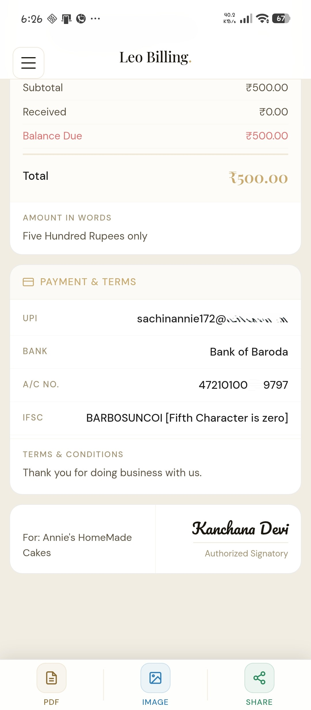 |

| Dark Mode | Share / Export |
|:---------:|:--------------:|
| 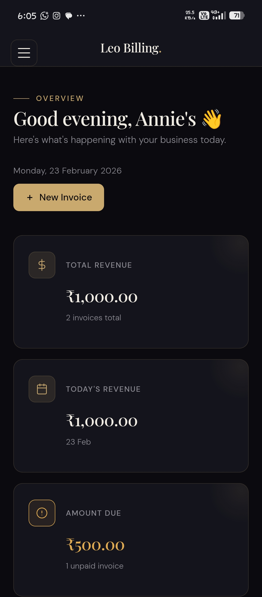 | 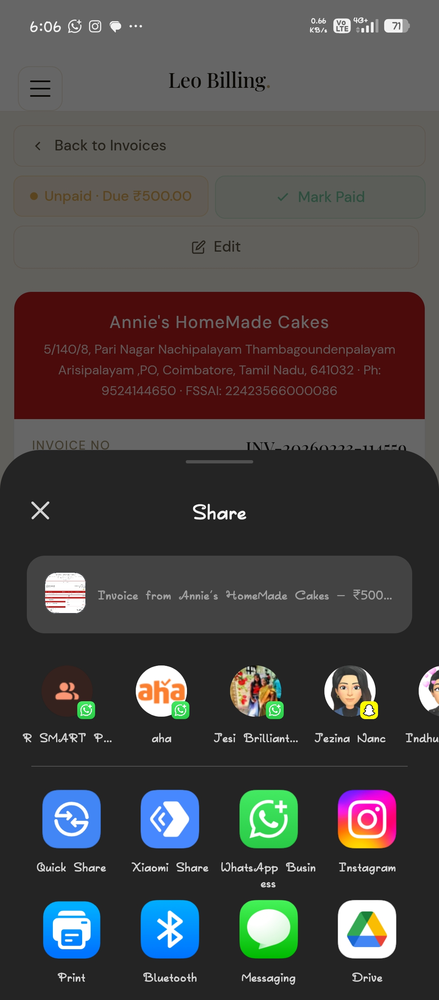 |

| Profile Edit P1 | Profile Edit P2|
|:---------:|:--------------:|
| 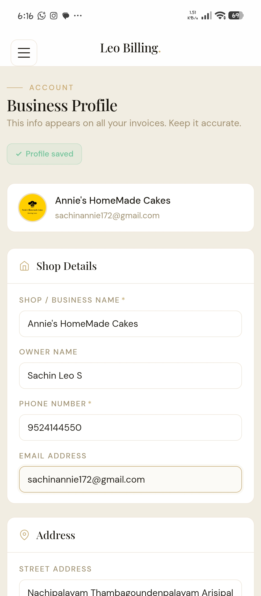 | 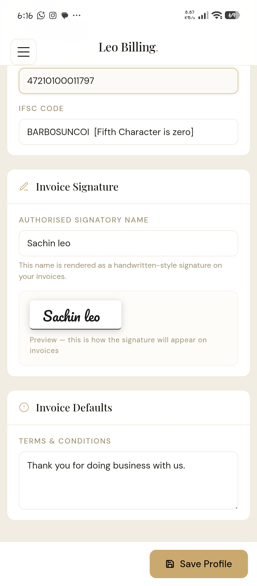 |


<!-- SCREENSHOTS END -->

---

## ✨ Features

- 🔐 **Google Sign-In** — secure one-tap login via Firebase
- 📊 **Dashboard** — revenue stats, today's sales, recent invoices at a glance
- 👥 **Customers** — add, edit, delete, search; auto-tracks total purchase value
- 📦 **Products** — manage inventory with unit & price support
- 🧾 **Invoices** — create, edit, delete, duplicate, search, mark paid/unpaid
- 🖨️ **Export** — download as PDF or PNG image
- 📤 **Native Share** — share invoice directly to WhatsApp, Telegram, Email & more
- ☁️ **Cloud Sync** — Supabase (PostgreSQL) backend, data accessible anywhere
- 🌓 **Dark / Light Mode** — easy on the eyes, remembers your preference
- 📱 **Cross-Platform** — full web app + native Android APK via Capacitor

---

## 🛠️ Tech Stack

| Layer | Technology |
|---|---|
| Frontend | React 19 + Vite |
| Styling | CSS Modules (custom, no UI library) |
| Routing | React Router DOM 7 |
| Auth | Firebase Authentication (Google Sign-In) |
| Database | Supabase (PostgreSQL) |
| Mobile | Capacitor 8 (Android) |
| PDF / Image | jsPDF + html2canvas |
| Web Deployment | Vercel |
| APK Distribution | GitHub Releases |

---

## 🚀 Getting Started

### Prerequisites

- Node.js 20+
- npm or yarn
- Android Studio *(only needed to build the APK)*

### 1. Clone & Install

```bash
git clone https://github.com/yourusername/leo-billing.git
cd leo-billing
npm install
```

### 2. Environment Variables

Create a `.env` file in the project root:

```env
# Firebase
VITE_FIREBASE_API_KEY=your_firebase_api_key
VITE_FIREBASE_AUTH_DOMAIN=your_firebase_auth_domain
VITE_FIREBASE_PROJECT_ID=your_firebase_project_id
VITE_FIREBASE_STORAGE_BUCKET=your_firebase_storage_bucket
VITE_FIREBASE_MESSAGING_SENDER_ID=your_firebase_sender_id
VITE_FIREBASE_APP_ID=your_firebase_app_id

# Supabase
VITE_SUPABASE_URL=your_supabase_url
VITE_SUPABASE_ANON_KEY=your_supabase_anon_key
```

### 3. Run the Web App

```bash
npm run dev
```

### 4. Build the Android APK

```bash
npm run build          # Build the React app
npx cap sync android   # Sync web assets to Android project
npx cap open android   # Open in Android Studio
```

In Android Studio: **Build → Build Bundle(s) / APK(s) → Build APK(s)**

Your APK will be at: `android/app/build/outputs/apk/debug/app-debug.apk`

---

## 📂 Project Structure

```
src/
├── pages/          # Login, Dashboard, Customers, Products,
│                   # Invoices, CreateInvoice, ViewInvoice, EditInvoice
├── components/     # Sidebar, InvoiceForm, ProductSearch, ProtectedRoute, Layout
├── services/       # invoiceService, customerService, productService, profileService
├── hooks/          # useAuth
├── utils/          # pdfExport, generateInvoiceNo
├── context/        # ThemeContext
└── App.jsx
```

---
---

## 🗄️ Database Structure

Leo Billing uses **Supabase (PostgreSQL)** as its backend. Each table is scoped by `user_id` (Firebase UID), ensuring complete data isolation between users.

---

### Schema Overview

```
business_profiles   ← one profile per user (shop details, bank info)
customers           ← customer directory per user
products            ← product catalog per user
invoices            ← invoice headers per user
invoice_items       ← line items linked to each invoice
```

---

### Tables

#### `business_profiles`
Stores the shop/business details shown on invoices.

| Column | Type | Description |
|---|---|---|
| `id` | int8 | Primary key |
| `user_id` | text | Firebase UID (unique per user) |
| `shop_name` | text | Business name |
| `owner_name` | text | Owner full name |
| `phone` | text | Contact number |
| `email` | text | Business email |
| `address`, `city`, `state`, `pincode` | text | Address fields |
| `gstin` | text | GST identification number |
| `fssai_no` | text | FSSAI license number |
| `upi_id` | text | UPI payment ID |
| `bank_name`, `account_no`, `ifsc_code` | text | Bank details |
| `signatory_name` | text | Name on invoice signature |
| `terms` | text | Invoice terms & conditions |
| `created_at`, `updated_at` | timestamptz | Timestamps |

---

#### `customers`
Customer directory with auto-tracked purchase totals.

| Column | Type | Description |
|---|---|---|
| `id` | int8 | Primary key |
| `user_id` | text | Firebase UID |
| `name` | text | Customer name |
| `phone` | text | Phone number |
| `email` | text | Email (optional) |
| `address` | text | Address (optional) |
| `total_purchase` | numeric | Cumulative purchase value |
| `created_at` | timestamptz | Record creation timestamp |

---

#### `products`
Product/item catalog used for quick invoice entry.

| Column | Type | Description |
|---|---|---|
| `id` | int8 | Primary key |
| `user_id` | text | Firebase UID |
| `name` | text | Product name |
| `description` | text | Optional description |
| `price` | numeric | Unit price |
| `unit` | text | Unit of measure (kg, pcs, etc.) |
| `stock` | int4 | Stock count |
| `category` | text | Product category |
| `gst_rate` | numeric | GST percentage |
| `created_at` | timestamptz | Record creation timestamp |

---

#### `invoices`
Invoice headers — one row per invoice.

| Column | Type | Description |
|---|---|---|
| `id` | int8 | Primary key |
| `user_id` | text | Firebase UID |
| `invoice_no` | text | Auto-generated invoice number |
| `date` | date | Invoice date |
| `time` | text | Invoice time |
| `customer_id` | int8 | FK → `customers.id` |
| `customer_name` | text | Denormalized customer name |
| `customer_phone` | text | Denormalized customer phone |
| `subtotal` | numeric | Sum before discounts |
| `discount_total` | numeric | Total discount applied |
| `final_amount` | numeric | Amount after discounts |
| `amount_due` | numeric | Remaining unpaid amount |
| `payment_status` | text | `paid` or `unpaid` |
| `created_at` | timestamptz | Record creation timestamp |

---

#### `invoice_items`
Line items for each invoice — supports both catalog products and ad-hoc entries.

| Column | Type | Description |
|---|---|---|
| `id` | int8 | Primary key |
| `user_id` | text | Firebase UID |
| `invoice_id` | int8 | FK → `invoices.id` |
| `product_id` | int8 | FK → `products.id` (nullable for ad-hoc items) |
| `product_name` | text | Item name (denormalized) |
| `quantity` | numeric | Quantity |
| `unit` | text | Unit of measure |
| `price` | numeric | Unit price |
| `discount` | numeric | Per-item discount |
| `total` | numeric | Line total (`quantity × price − discount`) |

---

### Key Queries

**Fetch all invoices for the logged-in user:**
```sql
SELECT *
FROM invoices
WHERE user_id = $1
ORDER BY created_at DESC;
```

**Fetch invoice with all line items:**
```sql
SELECT
  i.*,
  ii.product_name,
  ii.quantity,
  ii.unit,
  ii.price,
  ii.discount,
  ii.total
FROM invoices i
JOIN invoice_items ii ON ii.invoice_id = i.id
WHERE i.id = $1 AND i.user_id = $2;
```

**Dashboard — total revenue and outstanding amount:**
```sql
SELECT
  SUM(final_amount)  AS total_revenue,
  SUM(amount_due)    AS total_outstanding,
  COUNT(*)           AS total_invoices
FROM invoices
WHERE user_id = $1;
```

**Today's sales:**
```sql
SELECT SUM(final_amount) AS today_revenue
FROM invoices
WHERE user_id = $1
  AND date = CURRENT_DATE;
```

**Top customers by purchase value:**
```sql
SELECT name, phone, total_purchase
FROM customers
WHERE user_id = $1
ORDER BY total_purchase DESC
LIMIT 5;
```

**Search invoices by customer name or invoice number:**
```sql
SELECT *
FROM invoices
WHERE user_id = $1
  AND (
    customer_name ILIKE '%' || $2 || '%'
    OR invoice_no  ILIKE '%' || $2 || '%'
  )
ORDER BY created_at DESC;
```

---

### Row Level Security (RLS)

All tables have RLS enabled. Each policy ensures a user can only read and write their own rows:

```sql
-- Example policy (applied to all tables)
CREATE POLICY "Users can access own data"
ON invoices
FOR ALL
USING (user_id = auth.uid()::text);
```

> **Note:** `auth.uid()` is cast to `text` to match the Firebase UID stored as a text field.

---
## 📸 Screenshots (DB)

<!-- SCREENSHOTS START — replace the placeholder rows below with your actual images -->
| Schema Visulizer |
|:--------------:|
| 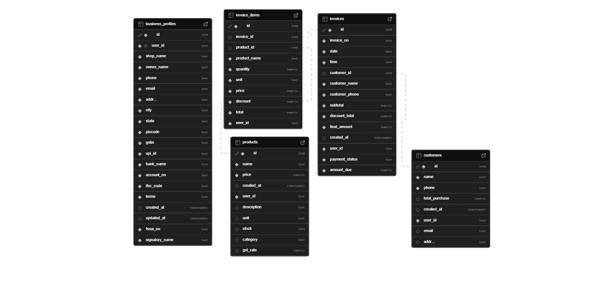 |


## 📲 Installing the APK on Android

1. Download the latest APK from [Releases](https://github.com/yourusername/leo-billing/releases/latest)
2. Open the APK file on your Android device
3. If prompted, tap **"Install from unknown sources"** and allow it
4. Install and open **Leo Billing**

---

## 🤝 Contributing

Contributions, issues and feature requests are welcome! Feel free to open an [issue](https://github.com/sachinle/leo-billing/issues) or submit a pull request.

